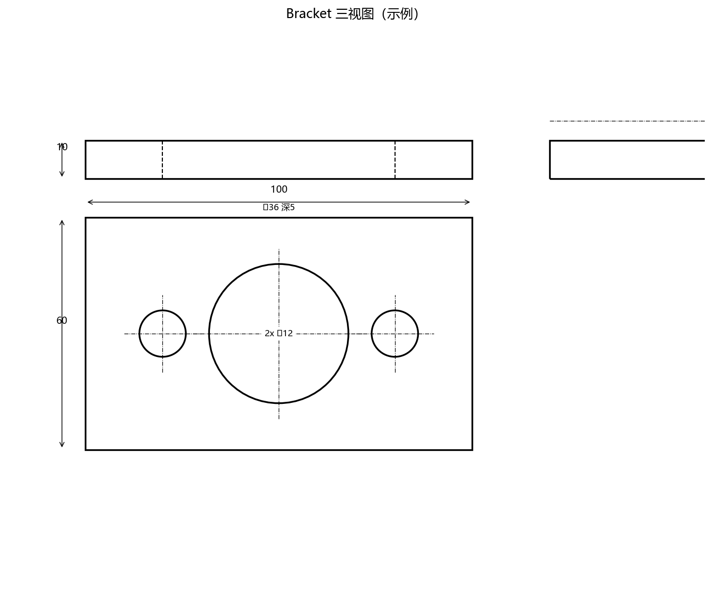

# catia-threeview-modeler

三视图转 CATIA 自动建模：从一张标准工程三视图（主/俯/左视图，含尺寸标注）自动在 CATIA V5 中建立**参数化、可编辑**的三维模型，并输出 `.CATProduct` 装配体（含其引用的 `.CATPart`）。



## 核心特性

- **保留完整特征树**：生成的是含关联草图的 Pad/Pocket/Hole/Fillet/Chamfer 参数化特征，绝非无参死实体（Dead Solid），可随时双击修改尺寸。
- **基准与坐标对齐**：模型主要对称面/加工基准面与绝对坐标系 XY/YZ/ZX 平面对齐，原点置于几何中心或基准孔处。
- **装配与零件逻辑**：单零件图纸 → 一个 `.CATPart` 挂载在产品树下；多零件图纸 → 自动拆分为独立 `.CATPart` 并按正确 position 装配。
- **防呆提问机制**：尺寸标注模糊/缺失、三视图投影矛盾时，**停止生成并向用户提问**，严禁臆造尺寸。
- **规范命名**：特征树节点统一命名（`Sketch_<id>` / `Pad_<id>` / `Hole_<id>`…，实体 `MainBody`）。

## 环境要求

- Windows + 已安装并运行的 CATIA V5（R2016 及以上，通过 COM 驱动）
- Python 3.8+，安装依赖：

```bash
pip install pycatia pywin32
```

## 快速开始

三视图 → 特征 JSON 的解读规则见 [`references/threeview_reading.md`](references/threeview_reading.md)，特征 JSON 字段定义见 [`references/features_schema.md`](references/features_schema.md)。

```bash
# 1) 环境自检（CATIA 需已运行）
python scripts/check_env.py

# 2) 校验并规范化特征 JSON（未通过不得建模）
python scripts/validate_features.py your_model.json --out your_model.normalized.json

# 3) 驱动 CATIA 建模，产出 .CATPart/.CATProduct 并截图核对
python scripts/catia_build.py your_model.normalized.json --output-dir out/ --capture out/
```

示例：见 [`examples/sample_bracket.features.json`](examples/sample_bracket.features.json)。

## 目录结构

```
catia-threeview-modeler/
├── SKILL.md                  # Skill 主文档（触发词、工作流、能力边界）
├── README.md
├── LICENSE
├── scripts/
│   ├── check_env.py          # 环境与 CATIA 连通自检
│   ├── validate_features.py  # 特征 JSON 校验与规范化
│   ├── catia_build.py        # 驱动 CATIA 建模，产出 CATPart/CATProduct
│   └── features_common.py    # 共享库：轮廓解析 / 闭合校验 / BRep 引用
├── references/
│   ├── threeview_reading.md  # 读图方法 + 防呆提问规则 + 核对清单
│   └── features_schema.md    # 特征 JSON 完整字段说明
└── examples/
    ├── sample_threeview.png
    └── sample_bracket.features.json
```

## 能力边界

- 支持：直线/圆弧/整圆轮廓的棱柱与回转凸台、通孔/沉孔式 Hole、矩形/圆形 Pocket、竖边圆角、顶/底面倒角、多零件装配定位。
- 不支持：自由曲面/扫掠/肋板/加强筋自动重建、螺纹孔与埋头孔（CATIA R21 实测 API 失败，需手工补充）、复杂阵列特征（用多个独立 Hole 表达）、工程图/标注输出。

## License

MIT
